# 实验一:基于 VirtualBox 的网络攻防基础环境搭建

## 实验内容

- [x] 虚拟硬盘配置成多重加载

- [x] 搭建虚拟机网络拓扑

- [x] 靶机可以直接访问攻击者主机

- [x] 攻击者主机无法直接访问靶机

- [x] 网关可以直接访问攻击者主机和靶机

- [x] 靶机的所有对外上下行流量必须经过网关

- [x] 所有节点均可以访问互联网

  


---

## 实验步骤

### 一、虚拟硬盘配置成多重加载

- 释放对应的.vdi硬盘，并将硬盘类型设置为多重加载

  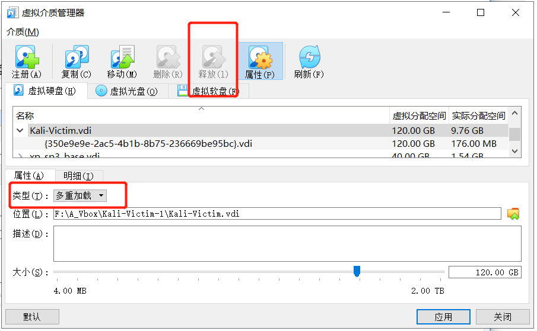


- 新建虚拟机，注册产生的多重加载硬盘，使用多重加载硬盘

  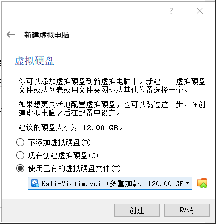


- 得到通过多重加载硬盘配置的虚拟机

  


### 二、搭建虚拟机网络拓扑

- 构建拓扑网络如下图：

  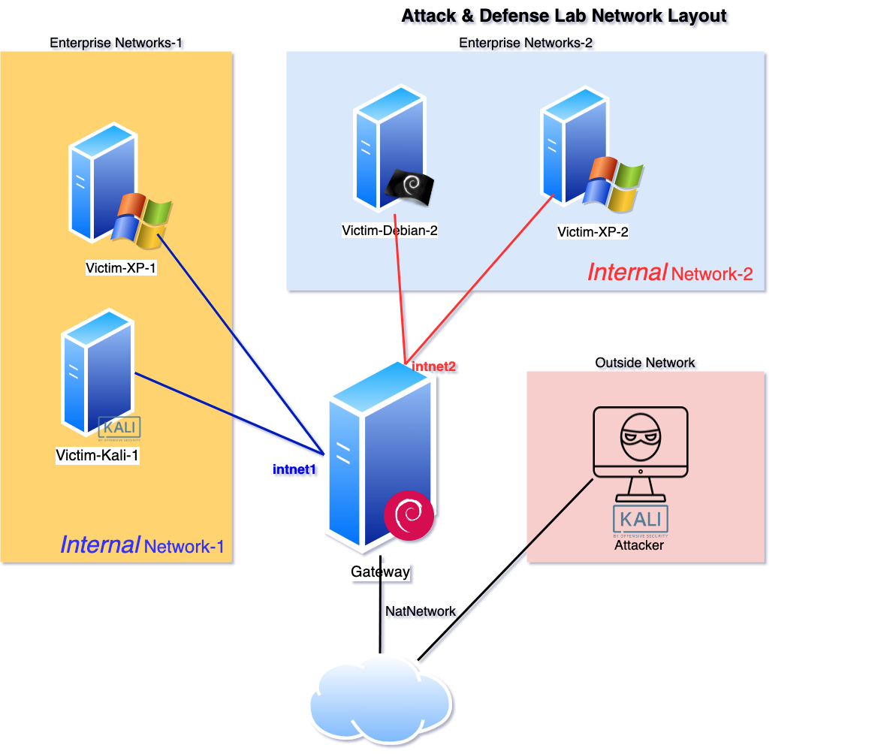


- 六台虚拟机的网卡类型及配置

| 虚拟机名称     | 网卡类型             | 网络                  | IP地址         |
| -------------- | -------------------- | --------------------- | -------------- |
| Kali-Attacker  | Int PRO/1000 MT 桌面 | NAT网络，’NatNetwork‘ | 10.0.2.4       |
| Kali-Victim    | Int PRO/1000 MT 桌面 | 内部网络， ’intnet1‘  | 172.16.111.104 |
| xp-Victim-1    | PCnet-FAST III       | 内部网络， ’intnet1‘  | 172.16.111.140 |
| xp-Victim-2    | PCnet-FAST III       | 内部网络， ’intnet2‘  | 172.16.222.126 |
| Debian-Victim  | Int PRO/1000 MT 桌面 | 内部网络， ’intnet2‘  | 172.16.222.139 |
| Debian-Gateway | Int PRO/1000 MT 桌面 | NAT网络，’NatNetwork‘ | 10.0.2.15      |
|                | Int PRO/1000 MT 桌面 | 内部网络， ’intnet1‘  | 172.16.111.1   |
|                | Int PRO/1000 MT 桌面 | 内部网络， ’intnet2‘  | 172.16.222.1   |

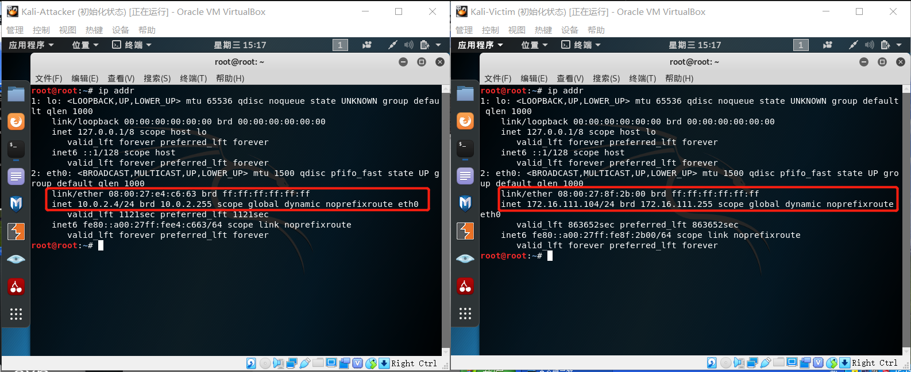

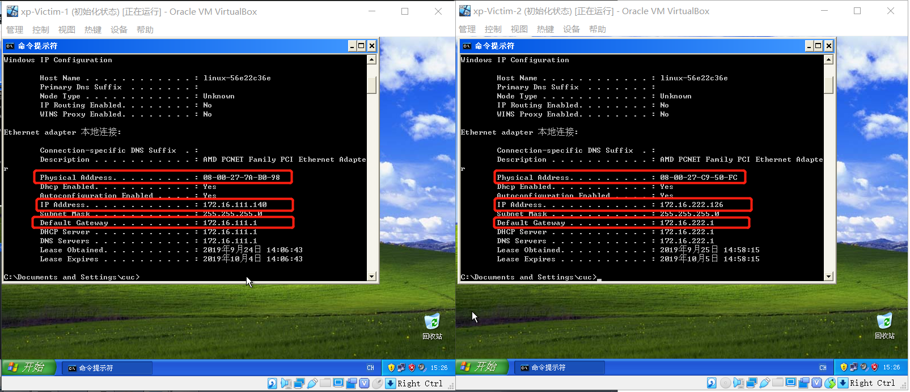

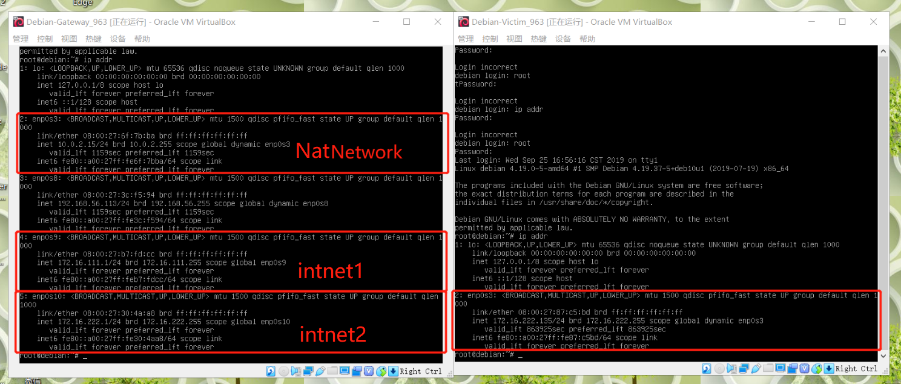


### 三、靶机可以直接访问攻击者主机

```
- 使用抓包检验网络连通性，靶机向攻击者发送一个ICMP包
攻击者 tcpdump -i eth0 icmp -s 0
靶机   ping 10.0.2.4 -c 1  （Linux下）
      ping 10.0.2.4 -n 1  （Windows下）

```

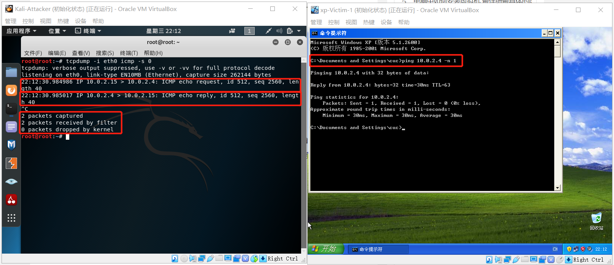

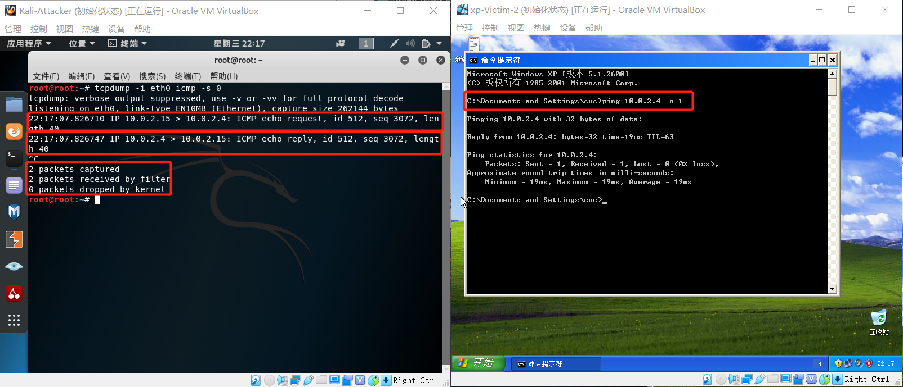


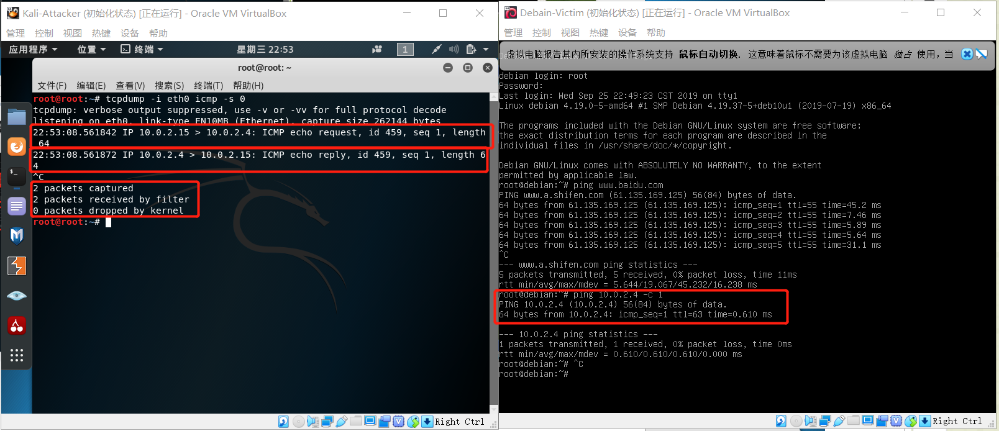


### 四、攻击者主机无法直接访问靶机

- 攻击者主机向靶机发送ICMP包，皆丢失，无法直接访问靶机

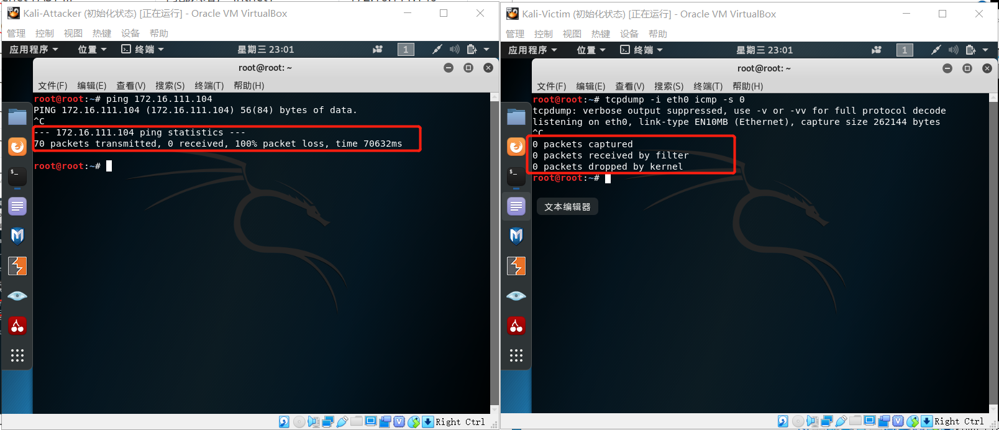

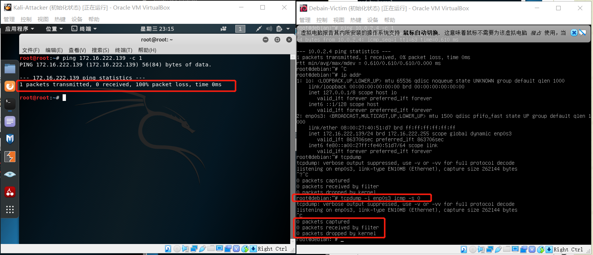


- 同理，攻击者无法访问 xp-victim-1、 xp-victim-2

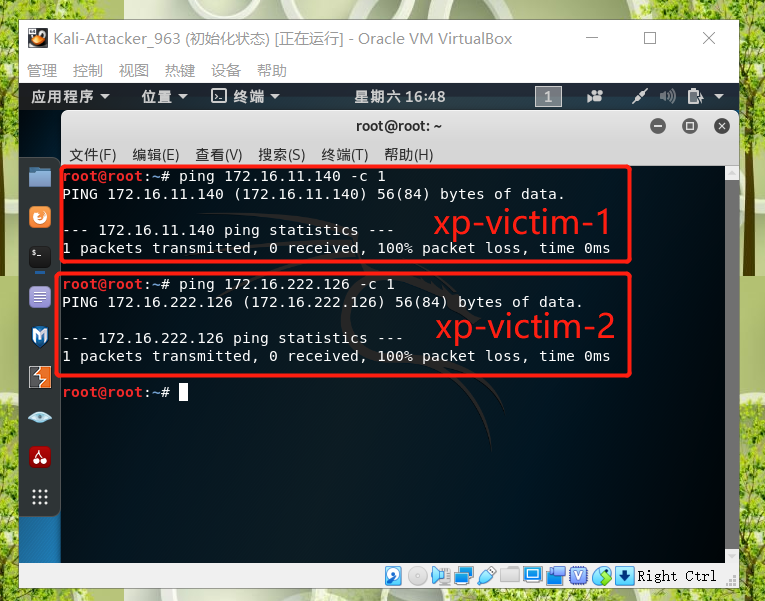

### 五、网关可以直接访问攻击者主机和靶机

- 网关直接访问攻击者

  

- 网关直接访问靶机kali

  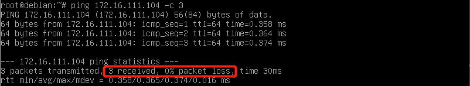

- 网关直接访问靶机debain

  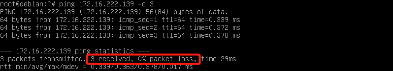

- 网关直接访问靶机xp-1 （注意关闭Windows防火墙）

  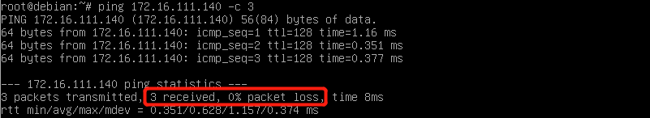

- 网关直接访问靶机xp-2 （注意关闭windows防火墙）

  

### 六、靶机的所有对外上下行流量必须经过网关

```
删除ARP记录 arp -d
确认ARP记录 arp -a
由下图可以确认网关和靶机处在同一局域网内
```


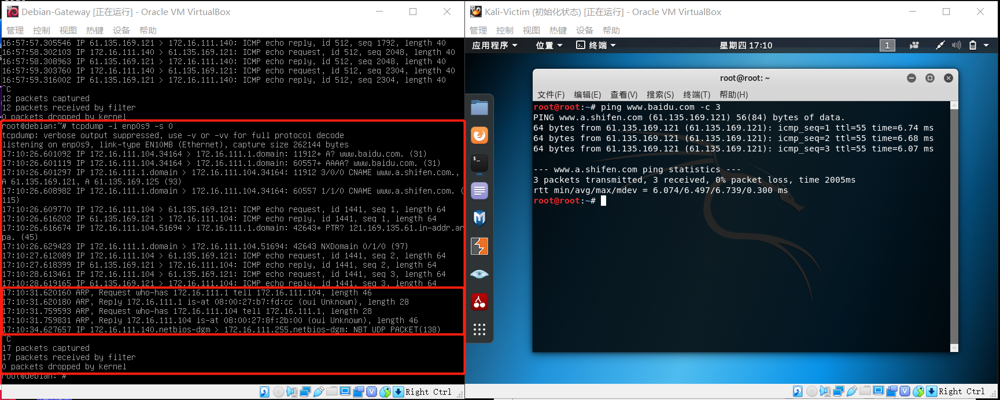

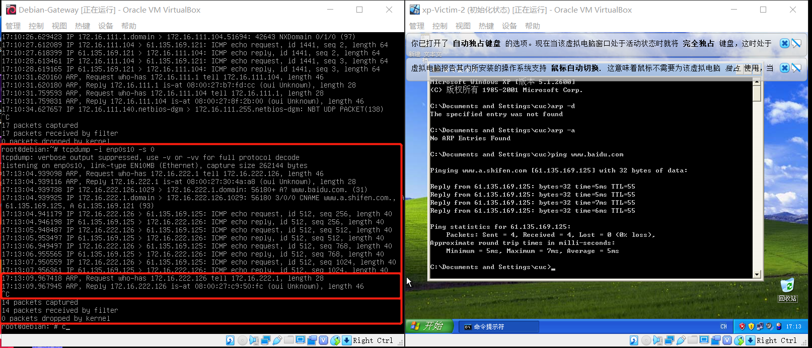

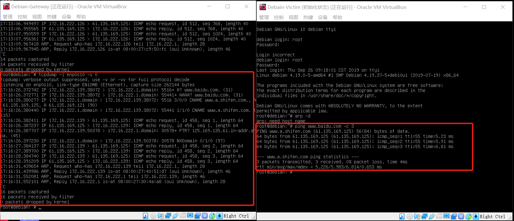


### 七、所有节点均可以访问互联网

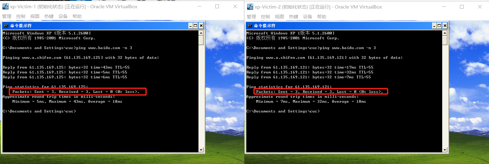


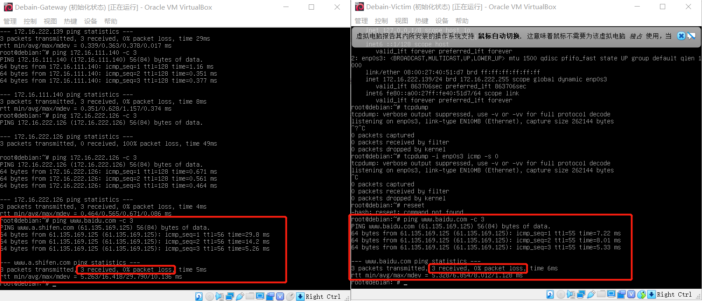

 

## 实验结论

- VirtualBox 的四种网络连接方式

  |                 | NAT  | Bridge Adapter | internal     | Host-only Adapter |
  | --------------- | ---- | -------------- | ------------ | ----------------- |
  | 虚拟机➡主机     | √    | √              | ×            | 默认不可需设置    |
  | 主机→虚拟机     | ×    | √              | ×            | 默认不可需设置    |
  | 虚拟机→其他主机 | √    | √              | ×            | 默认不可需设置    |
  | 其他主机→虚拟机 | ×    | √              | ×            | 默认不可需设置    |
  | 虚拟机→虚拟机   | ×    | √              | 同名网络下可 | √                 |

  

- NAT网络地址转换模式

  在计算机网络中,**网络地址转换是一种在IP数据包通过路由器路由器或防火墙时重写来源iP地址或目的IP地址的技术**。vbox相当于虚拟出了一个路由器，为该虚拟网络中的机器分配ip地址，默认网关为主机分配到的ip地址，DHCP服务器同上，虚拟机利用主机来进行对外部网络的访问。因此虚拟机可以访问主机及外部网络，但是也因为在当前网络中所分配的网络地址实际都是不存在的，其他网络环境的虚拟机以及主机是无法访问到该NAT网络的虚拟机的。

  

- Bridged Adapter   桥接模式 

  通过主机网卡，架设一座桥，直接接入网络，由主机所在网络中的DHCP服务器分配与主机网络同网段的ip地址，网关与本机网关相同。看起来相对独立，但因为虚拟机没有独立的硬件，所以还是要依赖本机网卡，主机一旦断开，即无法访问主机、外网和其他虚拟机。


- Internal   内部网络模式

  相当于建立了一个隔离的局域网，与外部网络及主机隔绝。由Vbox虚拟的内置DHCP服务器得到地址。数据包传输仅在局域网内进行，安全性高。

  

- Host-only Adapter  主机模式

  为各个虚拟机提供了一个与主机隔绝的虚拟局域网。网卡不能自动获得任何参数，除非手动设置或者在该网络环境中架设DHCP服务器。各虚拟机之间可以任意访问（虚拟机防火墙允许条件下），但不能访问主机的网络服务及internet。

  

- 实验中靶机与网关与攻击者间能否ping通的原因分析

  我们搭建的是一个综合网络环境，主要由互联网、两个内网和一个NAT网络构成。

  **网关可以ping直接访问攻击者和主机**：四个靶机都各处于一个内网环境，可以与同属于同一个内网的网关互相ping同；而网关和攻击者处于同一个NAT网络，相当于在同一个子网，所以可以ping通。

  **靶机可以访问攻击者**：攻击者不在该局域网内，靶机与网关进行数据包交互，网关将内网ip改为外网ip，所以看起来相当于是网关在ping攻击者，所以结果表现为能够ping通。

  **攻击者无法访问靶机**：因为靶机对于攻击者来说是不存在的，所以目标主机不可达。

  **靶机所有对外上下行流量必须经过网关**：先清空靶机arp缓存，靶机想要访问外网，先通过arp广播找到作为网关的主机，得到主机的mac地址，与网关进行数据交互，之后的过程就是之前总结的网关通过NAT网络与网络互联的过程了。以此看来靶机所有对外上下行流量必须经过网关。该虚拟环境的所有节点皆可访问。


## 遇见的问题

- xp系统命令行内运行ipconfig，显示没有接口、没有网关；网络连接无显示.

  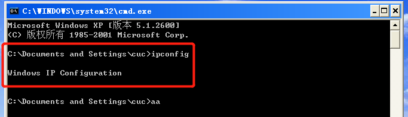

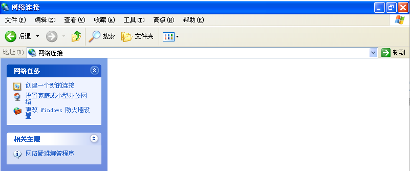


原因是对于XP系统来说我们配置的网卡级别太高，检测不到，解决方案就是更换配置更低一些的网卡

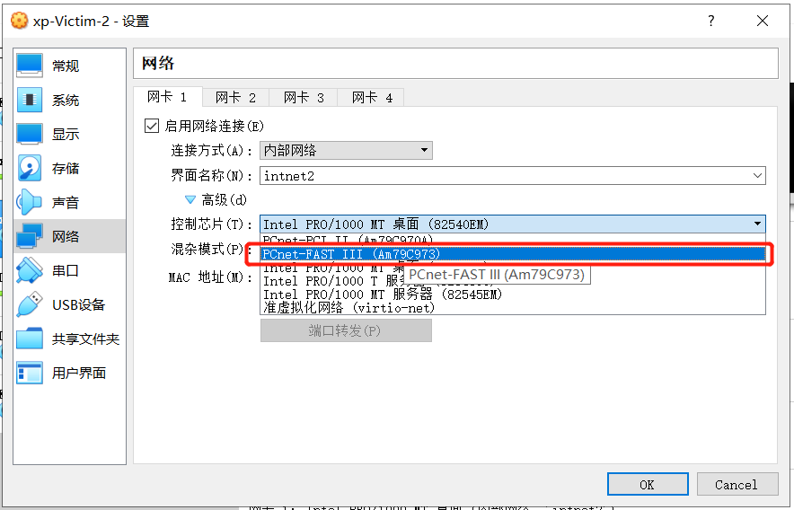


- debian系统无法使用ifconfig

  解决方案：```apt install net-tools ```  安装linux基础配置

 

- 获得了：169.254.开头的IP地址

  微软的系统设置为DHCP方式而又无法从DHCP服务器获得IP的时候，就会临时分配一个169.254.x.x的B类地址，局域网内的电脑就可以通过这个IP来相互通讯。实际上机器DHCP没有正常获得到地址，所以，操作系统自动给你分配了一个默认的地址。

  出错原因：网卡配置与Debian默认配置不同，现已修改


- 多重加载出错

  ```
  Cannot change the type of medium 'F:\A_Vbox\Kali-Victim-1\Kali-Victim.vdi' because it is attached to 1 virtual machines.
  ```

  解决方案：把原来的备份快照删除

  

  
  
  

## 参考资料

[Wiki百科 网络地址转换](https://wikipedia.hk.wjbk.site/wiki/网络地址转换)

[VirtualBox中的网络连接方式详解](https://blog.csdn.net/yushupan/article/details/78404395)