# 实验一:基于 VirtualBox 的网络攻防基础环境搭建

## 实验内容

- [x] 虚拟硬盘配置成多重加载

- [x] 搭建虚拟机网络拓扑

- [x] 靶机可以直接访问攻击者主机

- [x] 攻击者主机无法直接访问靶机

- [x] 网关可以直接访问攻击者主机和靶机

- [x] 靶机的所有对外上下行流量必须经过网关

- [x] 所有节点均可以访问互联网

  


---

## 实验步骤

### 一、虚拟硬盘配置成多重加载

- 释放对应的.vdi硬盘，并将硬盘类型设置为多重加载

  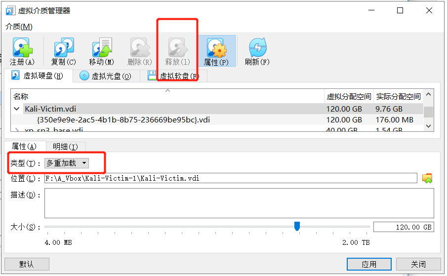


- 新建虚拟机，注册产生的多重加载硬盘，使用多重加载硬盘

  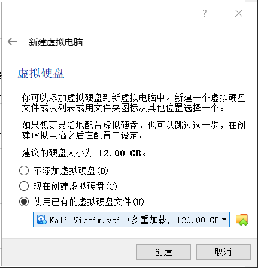


- 得到通过多重加载硬盘配置的虚拟机

  


### 二、搭建虚拟机网络拓扑

- 构建拓扑网络如下图：

  


- 六台虚拟机的网卡类型及配置

| 虚拟机名称     | 网卡类型             | 网络                  | IP地址         |
| -------------- | -------------------- | --------------------- | -------------- |
| Kali-Attacker  | Int PRO/1000 MT 桌面 | NAT网络，’NatNetwork‘ | 10.0.2.4       |
| Kali-Victim    | Int PRO/1000 MT 桌面 | 内部网络， ’intnet1‘  | 172.16.111.104 |
| xp-Victim-1    | PCnet-FAST III       | 内部网络， ’intnet1‘  | 172.16.111.140 |
| xp-Victim-2    | PCnet-FAST III       | 内部网络， ’intnet2‘  | 172.16.222.126 |
| Debian-Victim  | Int PRO/1000 MT 桌面 | 内部网络， ’intnet2‘  | 172.16.222.139 |
| Debian-Gateway | Int PRO/1000 MT 桌面 | NAT网络，’NatNetwork‘ | 10.0.2.15      |
|                | Int PRO/1000 MT 桌面 | 内部网络， ’intnet1‘  | 172.16.111.1   |
|                | Int PRO/1000 MT 桌面 | 内部网络， ’intnet2‘  | 172.16.222.1   |

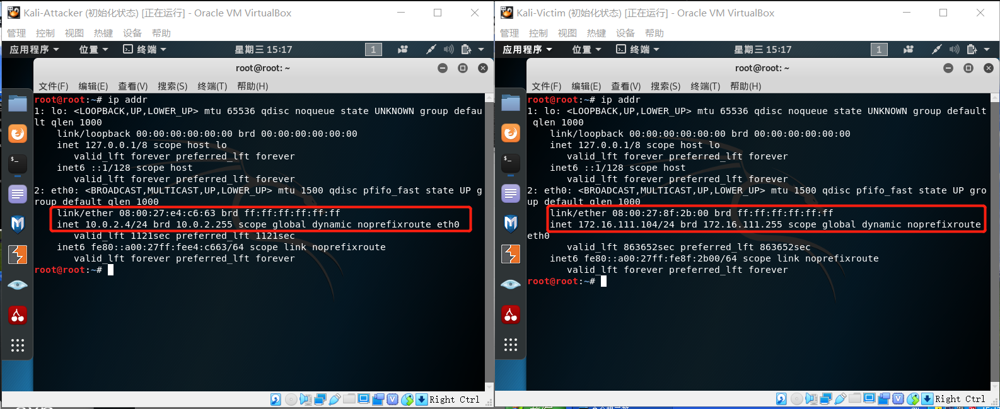

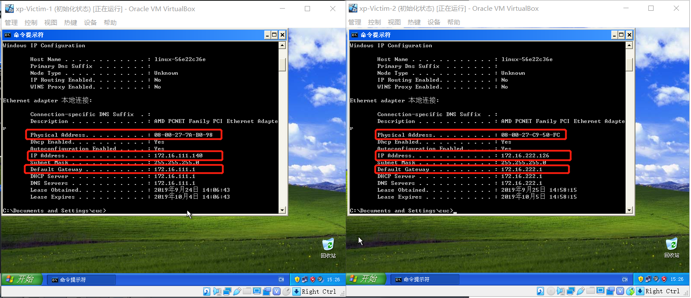

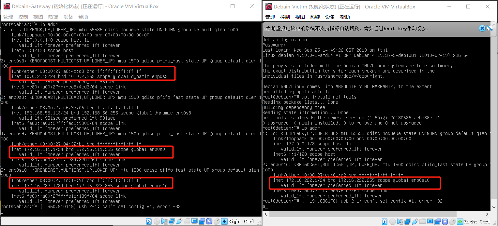


### 三、靶机可以直接访问攻击者主机

```
- 使用抓包检验网络连通性，靶机向攻击者发送一个ICMP包
攻击者 tcpdump -i eth0 icmp -s 0
靶机   ping 10.0.2.4 -c 1  （Linux下）
      ping 10.0.2.4 -n 1  （Windows下）

```

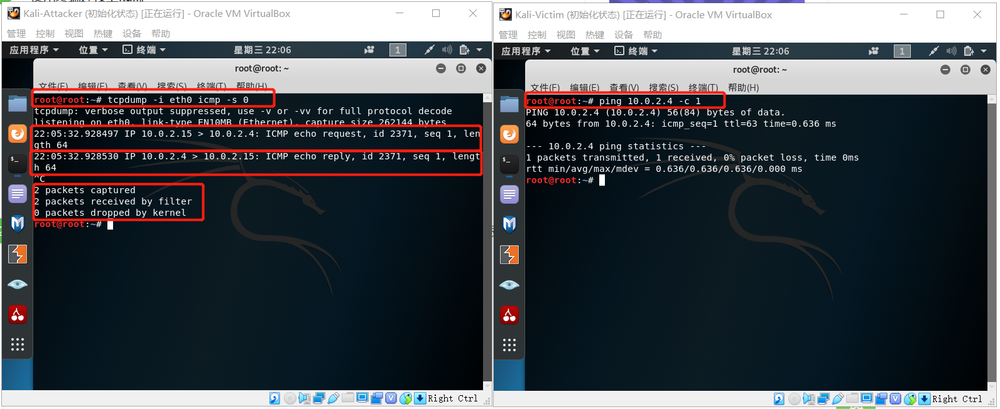

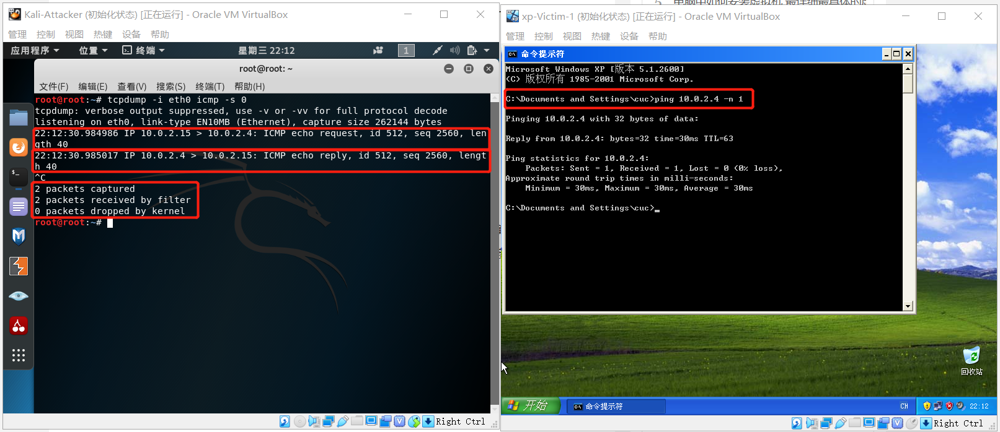

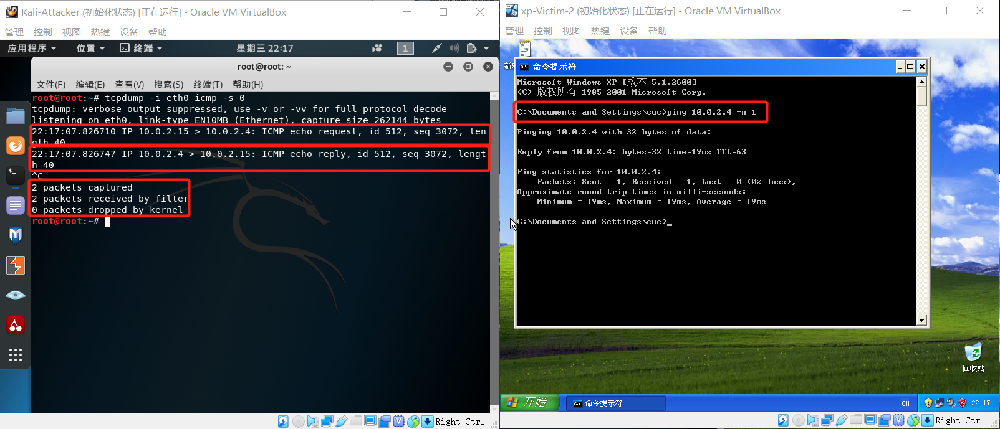

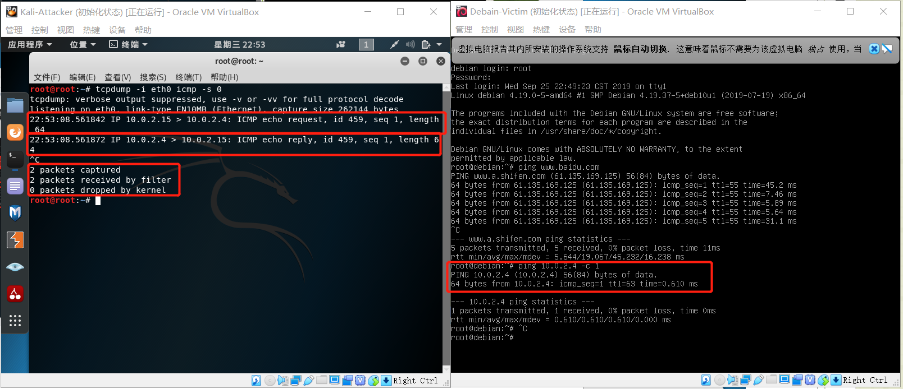


### 四、攻击者主机无法直接访问靶机

- 攻击者主机向靶机发送ICMP包，皆丢失，无法直接访问靶机


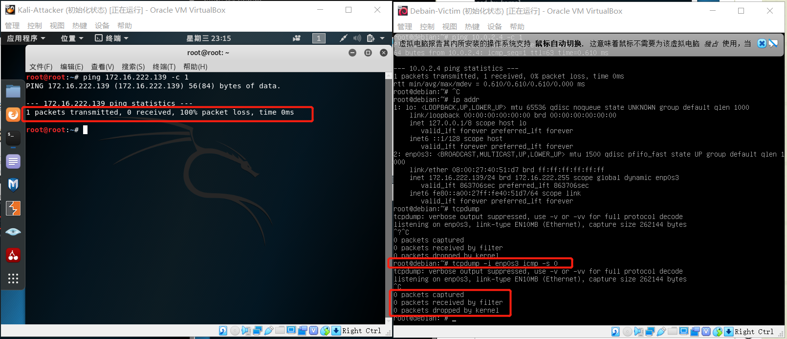


- 同理，攻击者无法访问 xp-victim-1、 xp-victim-2

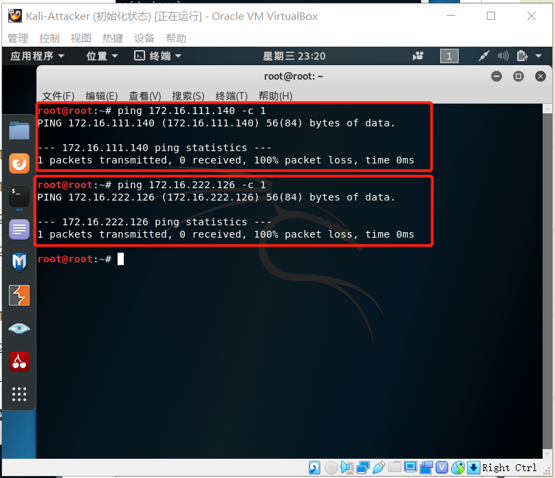

### 五、网关可以直接访问攻击者主机和靶机

- 网关直接访问攻击者

  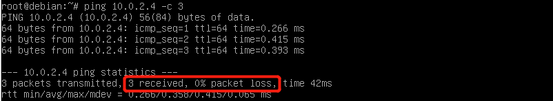

- 网关直接访问靶机kali

  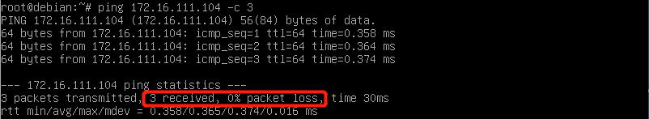

- 网关直接访问靶机debain

  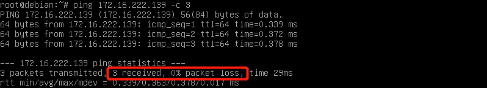

- 网关直接访问靶机xp-1 （注意关闭Windows防火墙）

  

- 网关直接访问靶机xp-2 （注意关闭windows防火墙）

  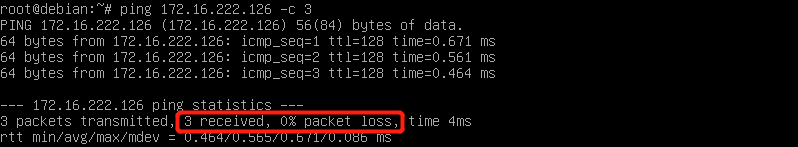

### 六、靶机的所有对外上下行流量必须经过网关

```
删除ARP记录 arp -d
确认ARP记录 arp -a
由下图可以确认网关和靶机处在同一局域网内
```

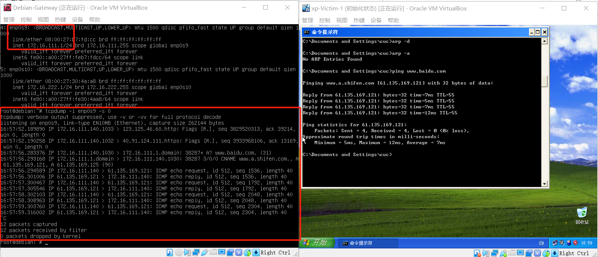

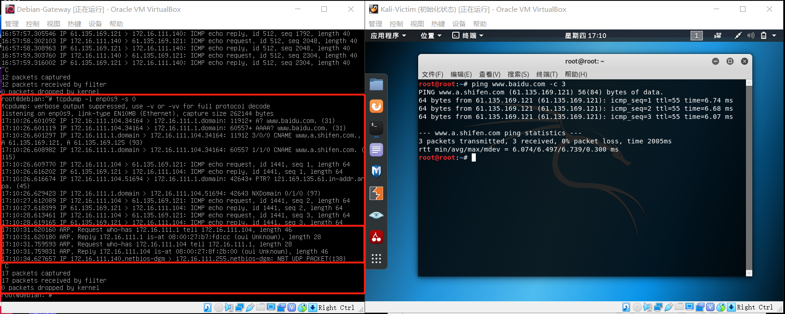

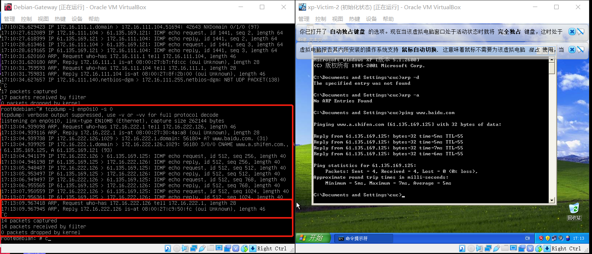

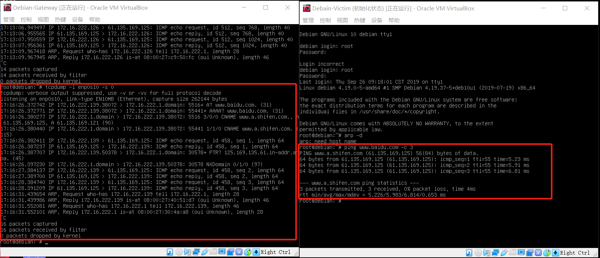


### 七、所有节点均可以访问互联网

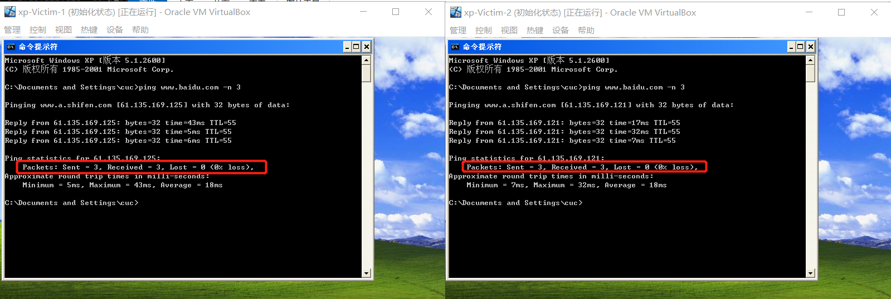

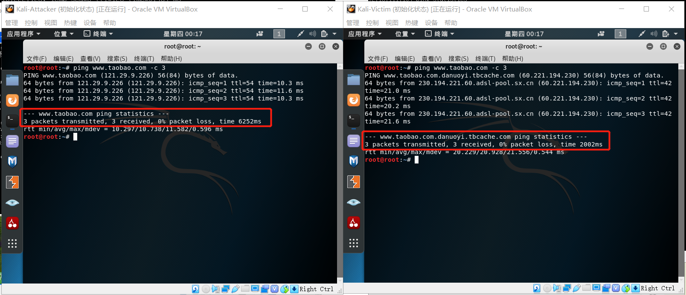

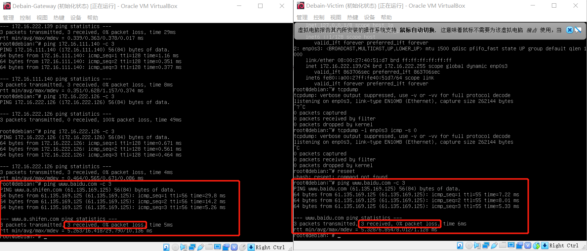

 

## 遇见的问题

- xp系统命令行内运行ipconfig，显示没有接口、没有网关；网络连接无显示.

  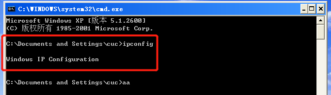

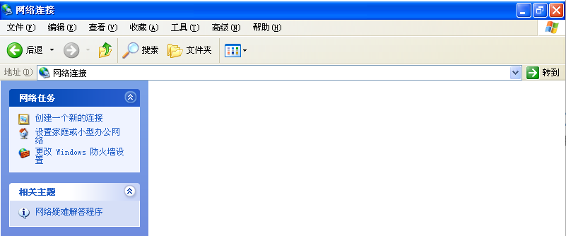


原因是对于XP系统来说我们配置的网卡级别太高，检测不到，解决方案就是更换配置更低一些的网卡

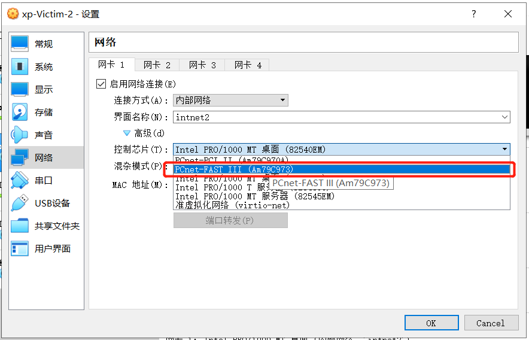


- debian系统无法使用ifconfig

  解决方案：```apt install net-tools ```  安装linux基础配置

 

- 获得了：169.254.开头的IP地址

  微软的系统设置为DHCP方式而又无法从DHCP服务器获得IP的时候，就会临时分配一个169.254.x.x的B类地址，局域网内的电脑就可以通过这个IP来相互通讯。实际上机器DHCP没有正常获得到地址，所以，操作系统自动给你分配了一个默认的地址。

  出错原因：网卡配置与Debian默认配置不同，现已修改


- 多重加载出错

  ```
  Cannot change the type of medium 'F:\A_Vbox\Kali-Victim-1\Kali-Victim.vdi' because it is attached to 1 virtual machines.
  ```

  解决方案：把原来的备份快照删除

  

  


